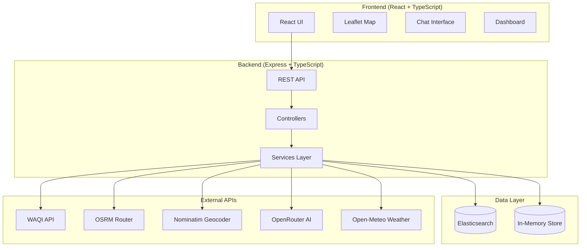
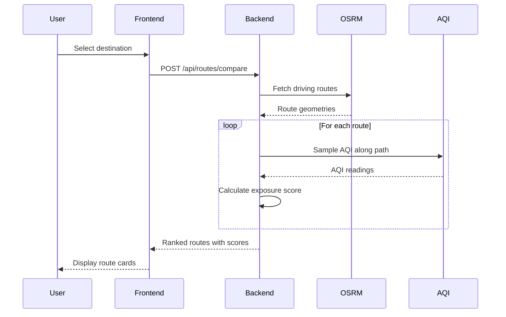
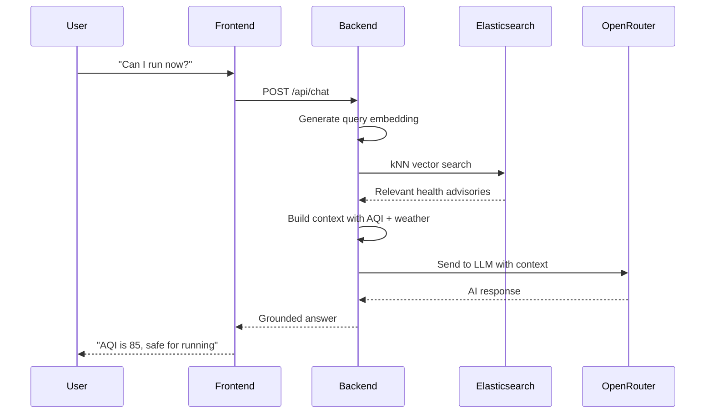
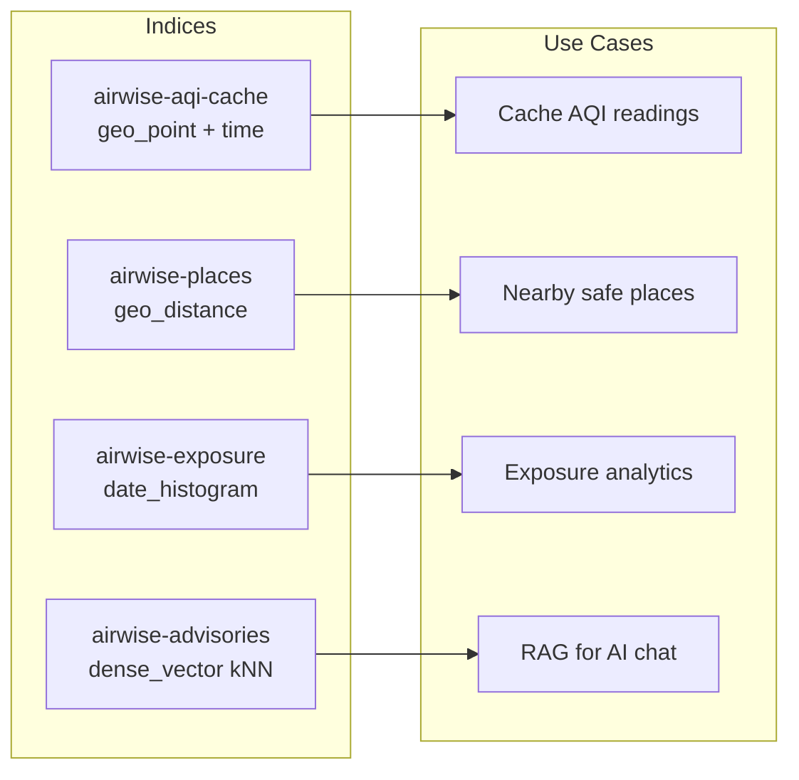
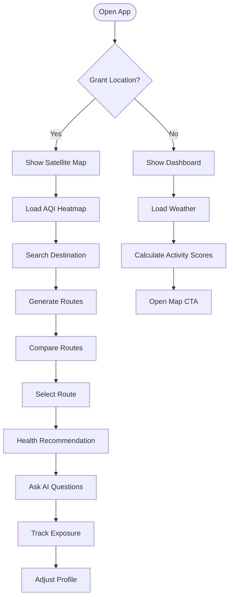
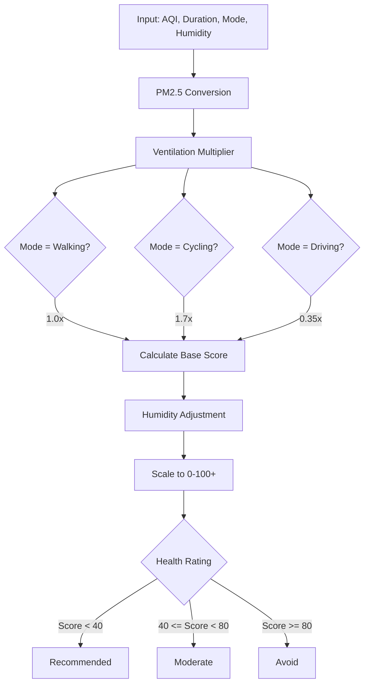
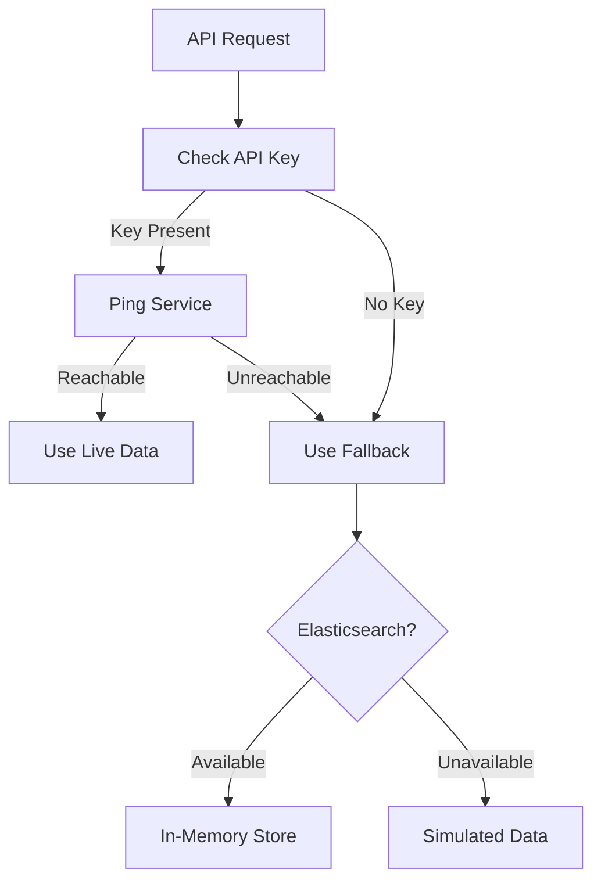

# AirWise AI — Delhi Air Quality & Public Health Companion

<p align="center">
  
</p>

<p align="center">
  <strong>AI-powered public health companion for smarter outdoor decisions in Delhi</strong>
</p>

<p align="center">
  <a href="#features">Features</a> •
  <a href="#architecture">Architecture</a> •
  <a href="#flow-diagrams">Flow Diagrams</a> •
  <a href="#getting-started">Getting Started</a> •
  <a href="#api-documentation">API</a> •
  <a href="#project-structure">Structure</a>
</p>

---

## Overview

AirWise AI transforms raw environmental data into **actionable health decisions** for Delhi residents. Instead of showing bare AQI numbers, it answers real questions:

> *"Should I go for a run right now?"*  
> *"Which route exposes me to the least pollution?"*  
> *"Is it safe for my child to play outside?"*

The app combines live air quality, weather, routing, and conversational AI to provide personalized, location-aware health recommendations.

---

## Features

### Core Capabilities

| Feature | Description |
|---------|-------------|
| **Live AQI Map** | Satellite map with Strava-style pollution heatmap overlay across Delhi NCR |
| **Route Comparison** | Multiple routes ranked by pollution exposure, not just distance |
| **Exposure Score** | Custom formula: AQI × duration × transport mode × humidity = real health impact |
| **AI Health Companion** | RAG-grounded chat answering "Can I run now?" using live environmental data |
| **Activity Scores** | Running, cycling, and outdoor scores adapted to your health profile |
| **Nearby Safe Places** | Parks and paths sorted by air quality |
| **Health Profiles** | Adult, Child, Senior, Asthma, COPD, Pregnant, Athlete — recommendations adapt |
| **Exposure History** | Track daily/weekly pollution exposure over time |
| **Smart Notifications** | Alerts when AQI rises or conditions improve |

### Design Philosophy

**Fallback-first architecture** — every external integration degrades gracefully:

| Service | Live Provider | Fallback |
|---------|---------------|----------|
| Data Store | Elasticsearch | In-memory store |
| AQI | WAQI API | Simulated model (Delhi diurnal pattern) |
| Routing | OSRM (driving) | Synthetic routes (all modes) |
| Search | Nominatim | Curated Delhi landmarks |
| AI Chat | OpenRouter | Rule-based responder |
| Weather | Open-Meteo | Static fallback |
| Map Tiles | Esri (keyless) | N/A |

**Result:** The app works with **zero configuration** — no API keys required.

---

## Architecture

### High-Level System Architecture



### Data Flow: Route Comparison



### Data Flow: AI Chat with RAG



### Elasticsearch Index Architecture



---

## Flow Diagrams

### User Journey



### Exposure Score Calculation



### Fallback Decision Tree



---

## Tech Stack

### Frontend

| Technology | Purpose |
|------------|---------|
| **React 18** | UI framework |
| **TypeScript** | Type safety |
| **Vite** | Build tool & dev server |
| **Tailwind CSS** | Utility-first styling |
| **Framer Motion** | Animations |
| **React Router v6** | Client-side routing |
| **Leaflet** | Interactive maps |
| **Axios** | HTTP client |

### Backend

| Technology | Purpose |
|------------|---------|
| **Express** | HTTP framework |
| **TypeScript** | Type safety |
| **Zod** | Request validation |
| **Elasticsearch** | Search, geo, vector, time-series |
| **bcryptjs** | Password hashing |
| **jsonwebtoken** | JWT authentication |

### External Services

| Service | Purpose | Cost |
|---------|---------|------|
| **WAQI API** | Live AQI data | Free tier available |
| **Open-Meteo** | Weather data | Free (no key) |
| **OSRM** | Driving routes | Free public server |
| **Nominatim** | Geocoding | Free (no key) |
| **Esri** | Satellite tiles | Free (no key) |
| **OpenRouter** | AI chat | Free models available |

---

## Getting Started

### Prerequisites

- **Node.js** 18+ 
- **npm** 9+

### Quick Start

```bash
# Clone the repository
git clone https://github.com/your-username/airwise-ai.git
cd airwise-ai

# Install dependencies (both workspaces)
npm install

# Start development servers
npm run dev
```

Open **http://localhost:5173** — the app works immediately with simulated data.

### Optional: Enable Live Data

```bash
# Copy environment templates
cp backend/.env.example backend/.env
cp frontend/.env.example frontend/.env
```

| Variable | Where | Purpose | Get One |
|----------|-------|---------|---------|
| `ELASTICSEARCH_NODE` | backend | Real geo/vector search | [Elastic Cloud](https://www.elastic.co/cloud) (free trial) |
| `WAQI_TOKEN` | backend | Live AQI readings | [aqicn.org](https://aqicn.org/data-platform/token/) (free) |
| `OPENROUTER_API_KEY` | backend | LLM chat responses | [openrouter.ai](https://openrouter.ai/keys) (free models) |

### Scripts

| Command | Description |
|---------|-------------|
| `npm run dev` | Run backend (:4000) + frontend (:5173) |
| `npm run dev:backend` | Backend only |
| `npm run dev:frontend` | Frontend only |
| `npm run build` | Typecheck + build both |
| `npm run seed` | Seed Delhi parks + health advisories |

---

## API Documentation

### Endpoints

| Method | Endpoint | Description |
|--------|----------|-------------|
| GET | `/api/health` | Health check + data store status |
| POST | `/api/auth/signup` | Create account |
| POST | `/api/auth/login` | Login |
| GET | `/api/aqi/current` | Current AQI for coordinates |
| GET | `/api/aqi/grid` | AQI heatmap grid |
| GET | `/api/weather/current` | Current weather |
| POST | `/api/routes/compare` | Compare routes with exposure scores |
| GET | `/api/places/nearby` | Nearby safe places |
| GET | `/api/search` | Geocoding/search |
| POST | `/api/chat` | AI health companion |
| GET | `/api/history` | Exposure history |
| POST | `/api/history/record` | Record exposure |

### Example: Route Comparison

**Request:**
```json
POST /api/routes/compare
{
  "origin": { "lat": 28.6139, "lon": 77.2090 },
  "destination": { "lat": 28.5244, "lon": 77.2066 },
  "mode": "walking",
  "healthProfile": "adult"
}
```

**Response:**
```json
{
  "routes": [
    {
      "id": "route-1",
      "label": "Fastest Route",
      "distanceMeters": 8500,
      "durationSeconds": 6120,
      "averageAqi": 142,
      "exposureScore": 45,
      "healthRating": "moderate",
      "recommendation": "Moderate exposure. Consider cycling instead for lower ventilation.",
      "geometry": [...]
    }
  ],
  "recommendedRouteId": "route-2"
}
```

---

## Project Structure

```
airwise-ai/
├── backend/
│   └── src/
│       ├── config/          # Environment configuration
│       ├── controllers/     # Request handlers
│       ├── data/            # Static data (Delhi landmarks, advisories)
│       ├── middleware/       # Auth, error handling
│       ├── routes/          # Route definitions
│       ├── services/        # Business logic + external integrations
│       ├── types/           # TypeScript types
│       └── utils/           # Utilities (AQI conversion, embeddings)
│
├── frontend/
│   └── src/
│       ├── components/
│       │   ├── cards/       # AQI, Weather, Score cards
│       │   ├── chat/        # Chat interface
│       │   ├── common/      # Reusable UI components
│       │   ├── layout/      # Navbar, Footer, AppLayout
│       │   └── map/         # Map, Heatmap, Search, Routes
│       ├── contexts/        # Auth, Location, Theme, Health Profile
│       ├── hooks/           # Custom React hooks
│       ├── pages/           # Route pages
│       ├── services/api/    # API client layer
│       └── utils/           # Helpers (AQI colors, scoring)
│
├── CLAUDE.md                # Detailed architecture notes
├── ProjectGuide.md          # Product specification
└── package.json             # npm workspaces config
```

---

## Key Implementation Details

### Heatmap Rendering

The pollution heatmap uses a custom canvas layer (`AQIHeatLayer.tsx`) with:
- **34×34 grid** covering Delhi NCR
- **Gaussian pollution sources** modeling real hotspots (Anand Vihar, ITO, Okhla)
- **Cleaner pockets** (Delhi Ridge, Aravallis) with negative strength
- **Diurnal pattern** — worse at night, better in afternoon
- **CSS blur** fusing cells into continuous plumes

### Exposure Formula

```
Exposure = AQI × duration × ventilation_mode × humidity_factor
```

| Mode | Ventilation Rate |
|------|------------------|
| Walking | 1.0x |
| Cycling | 1.7x |
| Driving | 0.35x |

### Theming

CSS-variable driven with `.light`/`.dark` class toggle:
- Colors defined as `--c-bg`, `--c-surface`, `--c-accent`
- Surfaced through Tailwind as `rgb(var(--c-…) / <alpha-value>)`
- `white` remapped to foreground — `text-white` inverts automatically

---

## Contributing

1. **Backend changes**: Implement in both `elasticStore.service.ts` and `memoryStore.service.ts`
2. **AQI thresholds**: Keep `backend/src/utils/aqi.util.ts` and `frontend/src/utils/aqi.ts` in sync
3. **Location hook**: Use `useUserLocation`, NOT `useLocation` (collides with react-router)
4. **Map markers**: Use `L.divIcon` with CSS classes, not `L.Icon` (Vite bundling issues)

---

## License

MIT

---

<p align="center">
  Built for Delhi residents who deserve smarter, healthier outdoor decisions.
</p>
